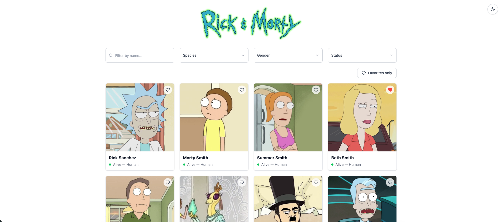

# Rick and Morty — Character Browser

Aplicação web para consulta de personagens da série **Rick and Morty**, consumindo a [API pública Rick and Morty](https://rickandmortyapi.com/). Permite listar, buscar, filtrar, favoritar e ver detalhes de cada personagem.

🔗 **Aplicação publicada:** [rickandmortyflavio.vercel.app](https://rickandmortyflavio.vercel.app/)



---

## ✨ Funcionalidades

### Obrigatórias
- ✅ Listagem de personagens (nome, foto, espécie e status)
- ✅ Busca por nome (com _debounce_)
- ✅ Filtros por status e espécie (+ gênero como extra)
- ✅ Página de detalhes (nome, imagem, espécie, gênero, origem, localização atual e quantidade de episódios)
- ✅ Estados de **Loading**, **Erro** e **Lista vazia**

### Diferenciais implementados
- ✅ **Paginação** (navegação por páginas Previous / Next, carregando ~20 personagens por vez)
- ✅ **Tema Dark / Light** (com persistência no `localStorage`)
- ✅ **Responsividade** (mobile, tablet e desktop)
- ✅ **Favoritos com LocalStorage** (+ filtro "Favorites only")
- ✅ **React Query** (cache e gerenciamento das requisições)
- ✅ **TypeScript**
- ✅ **React Router** (página de detalhes + página 404 personalizada)
- ✅ **Axios** (cliente HTTP centralizado)
- ✅ **Testes automatizados** (Vitest + Testing Library)
- ✅ **Deploy** (Vercel)
- ✅ **Modal de preview** (prévia rápida do personagem antes de abrir os detalhes)

---

## 🛠️ Tecnologias

| Tecnologia | Por que foi usada |
|---|---|
| **React + Vite** | Vite oferece build e dev server rápidos; React para a UI em componentes |
| **TypeScript** | Tipagem estática — menos bugs e melhor autocomplete |
| **Tailwind CSS** | Estilização rápida via classes utilitárias, com suporte nativo a dark mode |
| **TanStack React Query** | Cache, _refetch_ e estados de loading/erro das requisições sem código repetitivo |
| **Axios** | Cliente HTTP com instância centralizada e tratamento de erros (ex: 404) |
| **React Router** | Navegação entre a lista, os detalhes e a página 404 |
| **lucide-react** | Biblioteca de ícones leve (busca, coração, setas, tema) |
| **Vitest + Testing Library** | Testes unitários e de componente, integrados ao Vite |

---

## 📁 Estrutura de pastas

```
src/
├── assets/        # imagens (logo)
├── components/    # componentes reutilizáveis (Card, Modal, Filtros, etc.)
├── hooks/         # hooks customizados (useCharacters, useFavorites, useTheme...)
├── pages/         # páginas (lista, detalhes, 404)
├── services/      # comunicação com a API (axios)
├── test/          # configuração dos testes
├── types/         # tipos do TypeScript
├── utils/         # utilitários
└── styles/        # estilos globais
```

---

## 🚀 Como executar localmente

**Pré-requisitos:** [Node.js](https://nodejs.org/) 18+ instalado.

```bash
# 1. Clonar o repositório
git clone https://github.com/Flavim-rsr/RickAndMorty.git
cd RickAndMorty

# 2. Instalar as dependências
npm install

# 3. Rodar em modo de desenvolvimento
npm run dev
```

A aplicação abre em `http://localhost:5173`.

### Outros comandos

```bash
npm run build     # gera a build de produção
npm run preview   # serve a build de produção localmente
npm run lint      # roda o ESLint
npm test          # roda os testes (modo watch)
npx vitest run    # roda os testes uma vez
```

---

## 🧪 Testes

Os testes cobrem as duas pontas da aplicação:

- **Lógica** — `useFavorites` (adicionar/remover favoritos)
- **Componente** — `CharacterCard` (renderização do nome/status e clique no coração)

```bash
npx vitest run
```

---

## ☁️ Deploy

O projeto está publicado na **Vercel** com deploy automático a cada push na branch `main`.

🔗 **[rickandmortyflavio.vercel.app](https://rickandmortyflavio.vercel.app/)**
